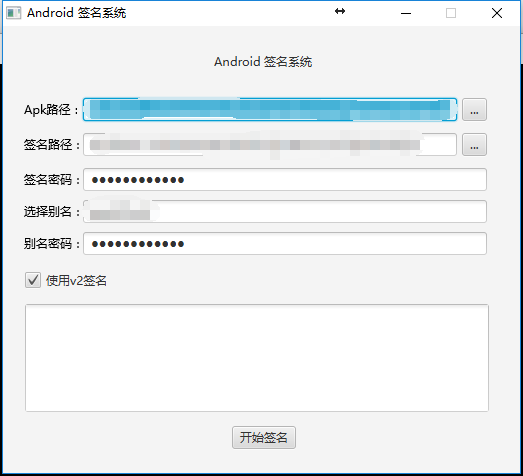

# Android-Signature
Android加密小工具，基于官方命令行的工具提供签名apk的GUI工具。

### 特性
* 提供基于Android官方的签名功能；
* 添加UI上的签名版本选择功能；

## 环境
* eclipse-SDK-4.6.0-win32-x86_64-distro-2.4.0(自带javafx)
* JDK1.8
* JavaFX Scene Builder 2.0

## 贡献代码
* 欢迎提交issue
* 欢迎提交PR

### 参考
* [APK Signature Scheme v2](https://source.android.com/security/apksigning/v2.html)
* [Android Source Code: ApkSigner](https://android.googlesource.com/platform/build/+/8740e9d)
* [Android Source Code: apksig](https://android.googlesource.com/platform/tools/apksig/)
